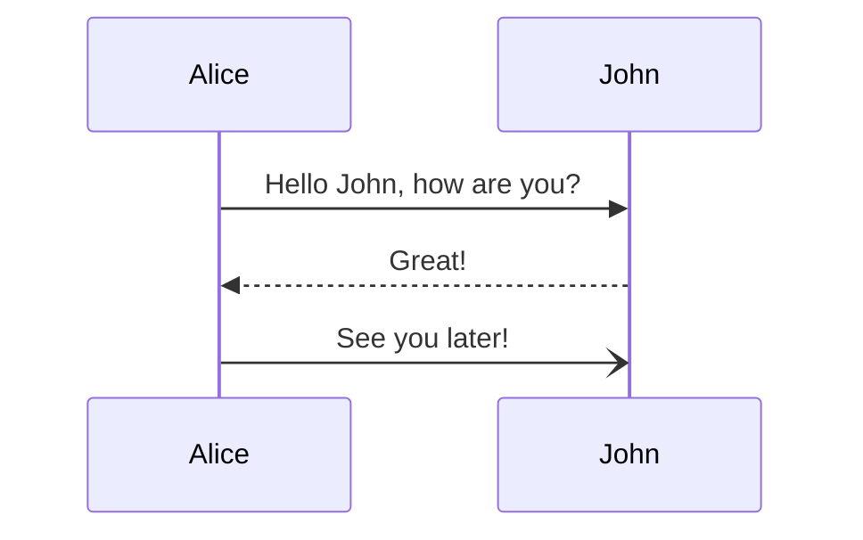

# 💤 LazyVim

A starter template for [LazyVim](https://github.com/LazyVim/LazyVim).
Refer to the [documentation](https://lazyvim.github.io/installation) to get started.

## header2

### header 3

#### header 4

| Column1 | Column2 |
| ------- | ------- |
| Item1.1 | Item2.1 |
| Item1.2 | Item2.2 |
| Item1.3 | Item2.3 |
| Item1.4 | Item2.4 |

```python

import math
```


